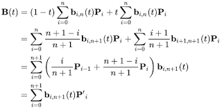
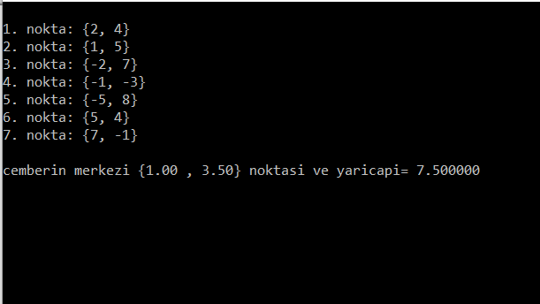
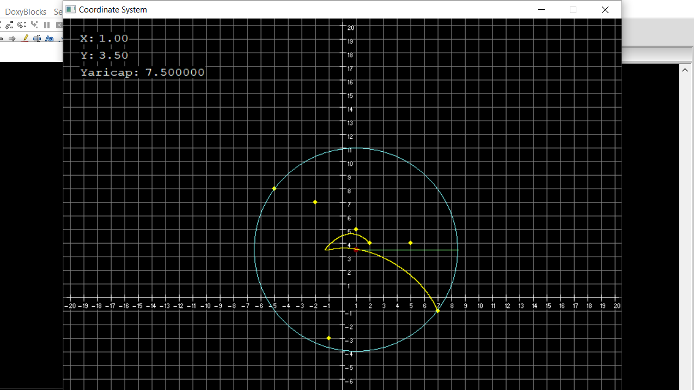
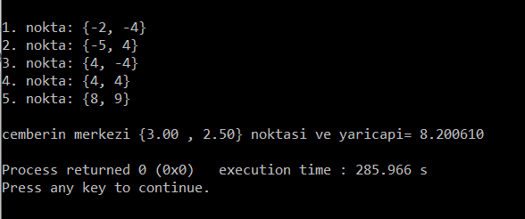
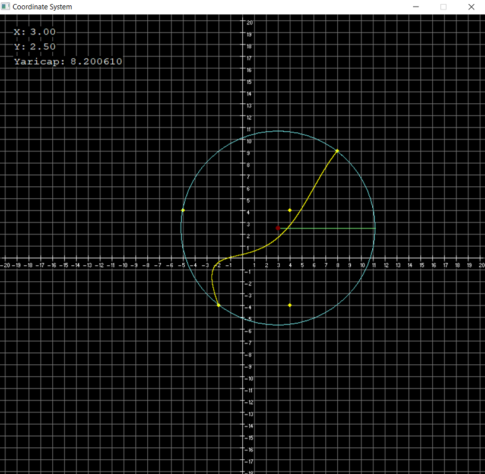

# MEC-Bezier

Minimum Enclosing Circle and Bezier Curve Project

Draws the smallest circle surrounding the given coordinate points and the bezier curve according to these points.

There is a bezier curve formula:

This is the first coordinate points:

and Coordinate System:

This is a second coordinate points:

and Coordinate System:

